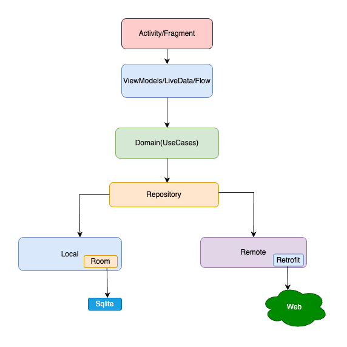

# Popular Movies App

This Kotlin-based Android application showcases popular movies and TV series using modern Android development practices. Built entirely with **Jetpack Compose** and **Material 3**, it follows the **MVVM pattern** and **Clean Architecture** principles.

## Table of Contents
- [Features](#features)
- [Architecture and Project Structure](#architecture-and-project-structure)
- [Technologies Used](#technologies-used)
- [Libraries Used](#libraries-used)
- [Screenshots](#screenshots)
- [Installation](#installation)
- [Usage](#usage)
- [Contributing](#contributing)
- [License](#license)
- [Copyrights](#copyrights)

## Features
- Browse popular movies and TV series
  - Filter by popular, top-rated, upcoming, and now playing
  - Horizontal category rows on the main screen
  - Dedicated category list screens with full browsing
- View detailed information about each movie or TV show
  - Collapsible header with backdrop image
  - Cast, videos, reviews, and overview sections
  - Favorite toggle with optimistic UI updates
- Search movies and TV shows with debounced input
- Save and manage favorite movies and TV shows
  - Sync favorites to TMDb account
  - Visual sync status indicators
- Authentication via TMDb account or guest mode
- Adaptive navigation layout (Material 3 Navigation Suite)
- Welcome screen with animated backdrop

## Architecture and Project Structure

The project follows **Clean Architecture** with clear separation of concerns, organized into feature modules and core modules.

For detailed architecture documentation, see [`documentation/ARCHITECTURE.md`](documentation/ARCHITECTURE.md).

https://developer.android.com/topic/architecture



### Module Structure

```
app/                           # Main entry point, Compose navigation, themes
build-logic/convention/        # Gradle convention plugins

features/
  movies/                      # Movie browsing, categories, and details
  tvshow/                      # TV series browsing, categories, and details
  favorites/                   # Saved favorites management
  search/                      # Search functionality
  login/                       # Authentication (login, welcome, account)

core/
  domain/                      # Use cases (business logic)
  data/                        # Repository implementations
  models/                      # Data models and entities
  database/                    # Room database
  network/                     # Network layer, data sources
  tmdbApi/                     # TMDb API client
  datastore/                   # DataStore preferences (session, guest mode)
  common/                      # Shared utilities, dispatcher qualifiers
  ui/                          # Shared UI components, navigation destinations
  resources/                   # Shared strings, drawables
  analytics/                   # Firebase Analytics/Crashlytics
```

### Key Patterns

- **Route/Screen separation** -- Route composables inject ViewModels, Screen composables are pure UI
- **`resultFlow()`** -- Centralized use case helper that wraps suspend blocks in `Loading/Success/Error` states
- **Dispatcher injection** -- Hilt qualifiers (`@IoDispatcher`, `@DefaultDispatcher`, `@ApplicationScope`) for testable coroutine code
- **StateFlow + `.update{}`** -- Thread-safe UI state management in all ViewModels
- **Convention plugins** -- Shared Gradle build logic via `build-logic/` (based on [Square's approach](https://developer.squareup.com/blog/herding-elephants/) and [idiomatic Gradle](https://github.com/jjohannes/idiomatic-gradle))

### Data Flow

```
User Interaction → Route (collectAsStateWithLifecycle)
    → ViewModel (StateFlow) → Use Case (resultFlow on IO dispatcher)
    → Repository → Network (TMDb API) / Database (Room) / DataStore
    → Flow<Result<T>> (Loading/Success/Error)
    → ViewModel (.update{}) → Route → Screen (pure UI)
```

## Screenshots
  

## Technologies Used
- **Language:** Kotlin 2.1+
- **UI:** Jetpack Compose, Material 3
- **Architecture:** MVVM + Clean Architecture
- **Async:** Kotlin Coroutines, Flow, StateFlow
- **DI:** Hilt (Dagger) with KSP
- **Networking:** Retrofit + OkHttp
- **Persistence:** Room, DataStore
- **Image Loading:** Coil (Compose integration)
- **Navigation:** Compose Navigation
- **Analytics:** Firebase Analytics, Crashlytics

## Libraries Used
- [Jetpack Compose](https://developer.android.com/jetpack/compose): Modern declarative UI toolkit for Android
- [Retrofit](https://square.github.io/retrofit/): A type-safe HTTP client for Android and Java
- [Coil](https://github.com/coil-kt/coil): An image loading library for Android backed by Kotlin Coroutines
- [Hilt](https://developer.android.com/training/dependency-injection/hilt-android): Dependency injection library that reduces boilerplate
- [Room](https://developer.android.com/training/data-storage/room): Persistence library providing an abstraction layer over SQLite
- [DataStore](https://developer.android.com/topic/libraries/architecture/datastore): Data storage solution for key-value pairs
- [Navigation Compose](https://developer.android.com/jetpack/compose/navigation): Navigation framework for Compose
- [MockK](https://mockk.io/ANDROID.html): A mocking library for Kotlin

## Installation
1. Clone the repository:
    ```bash
    git clone https://github.com/toaderandrei/popular-movies-kt.git
    ```
2. Open the project in Android Studio and sync with Gradle.
3. Obtain an API key from [The Movie Database (TMDb)](https://www.themoviedb.org/documentation/api) and add it to `local.properties`:
    ```properties
    tmdb_api_key=YOUR_API_KEY
    ```

## Usage
1. Run the application on an Android device or emulator.
2. Log in with your TMDb account or continue as guest.
3. Browse through movies and TV shows by category.
4. Tap on any item to view detailed information.
5. Save favorites and sync them to your TMDb account.

## Copyrights
UI inspired from TIVI app.
https://github.com/chrisbanes/tivi

## Contributing
Contributions are welcome! Please fork, create a feature branch, commit changes, and submit a pull request.

## License
MIT License

(c) 2024 Andrei Toader-Stanescu

Permission is hereby granted, free of charge, to any person obtaining a copy
of this software and associated documentation files (the "Software"), to deal
in the Software without restriction, including without limitation the rights
to use, copy, modify, merge, publish, distribute, sublicense, and/or sell
copies of the Software, and to permit persons to whom the Software is
furnished to do so, subject to the following conditions:

The above notice and this permission notice shall be included in all
copies or substantial portions of the Software.

THE SOFTWARE IS PROVIDED "AS IS", WITHOUT WARRANTY OF ANY KIND, EXPRESS OR
IMPLIED, INCLUDING BUT NOT LIMITED TO THE WARRANTIES OF MERCHANTABILITY,
FITNESS FOR A PARTICULAR PURPOSE AND NONINFRINGEMENT. IN NO EVENT SHALL THE
AUTHORS OR COPYRIGHT HOLDERS BE LIABLE FOR ANY CLAIM, DAMAGES OR OTHER
LIABILITY, WHETHER IN AN ACTION OF CONTRACT, TORT OR OTHERWISE, ARISING FROM,
OUT OF OR IN CONNECTION WITH THE SOFTWARE OR THE USE OR OTHER DEALINGS IN THE
SOFTWARE.
