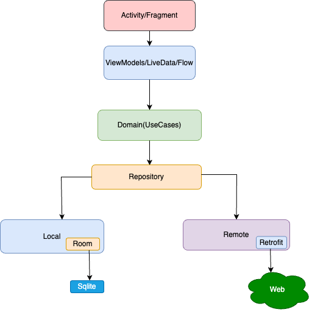
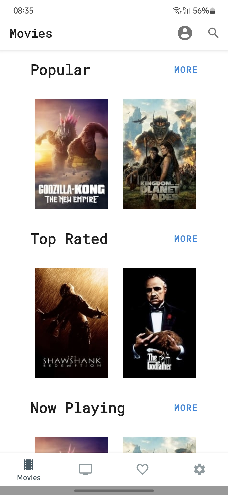
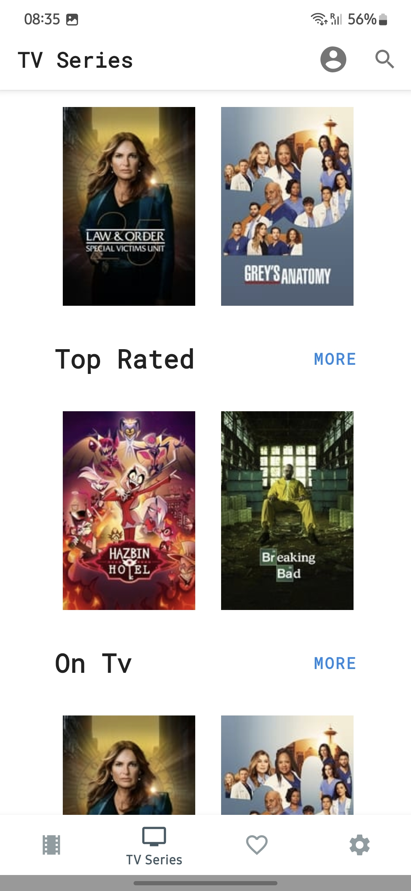
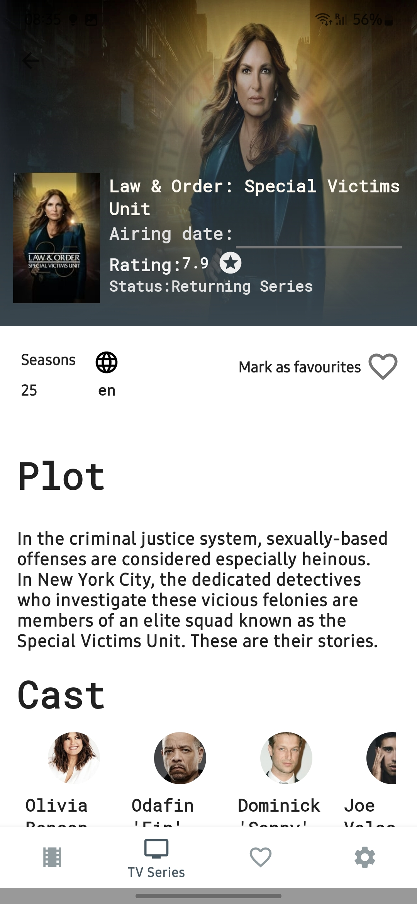

# Popular Movies App

This Kotlin-based Android application showcases popular movies and TV series using modern Android development practices. It follows the MVVM pattern and Clean Architecture principles.

## Table of Contents
- [Features](#features)
- [Project Structure](#Architecture-and-Project-Structure)
- [Technologies Used](#technologies-used)
- [Libraries Used](#libraries-used)
- [Screenshots](#screenshots)
- [Installation](#installation)
- [Usage](#usage)
- [Contributing](#contributing)
- [License](#license)
- [Copyrights](#copyrights)

## Features
- Browse popular movies and TV series.
  - Filter by popular, top-rated, upcoming, and now playing.
  - Horizontal lists for categories such as popular and upcoming movies.
  - Swipe horizontally on the main screen through categories.
- View detailed information about each movie or TV show.
- Dynamic loading of more results with swipe.
- Clean and modular code following MVVM and Clean Architecture.
- Save favorite movies and TV shows.
- View saved favorites, tv series or movies.


## Architecture and Project Structure
Architecture
The project follows the principles of Clean Architecture, focused on separation of concerns and maintainability.
https://developer.android.com/topic/architecture




It's organized into the following layers:
- **app**: Contains the main activity and UI components.
- **build-logic**: Gradle configurations and dependencies.
This approach is heavily based on https://developer.squareup.com/blog/herding-elephants/ and https://github.com/jjohannes/idiomatic-gradle.
- **common**: Common utilities and foundational classes.
- **common-ui**: Common UI components and extensions.
- **data**: Responsible for interacting with external data sources like networks or local databases using repositories and data sources.
- **domain**: Contains the business logic and use cases of the application.

## Screenshots
  

## Technologies Used
- Kotlin, Coroutines & Flow, Hilt, Retrofit, MVVM.

## Libraries Used
- [Retrofit](https://square.github.io/retrofit/): A type-safe HTTP client for Android and Java.
- [Epoxy](https://github.com/airbnb/epoxy): A library for building complex RecyclerView layouts.
- [Coil](https://github.com/coil-kt/coil): An image loading library for Android backed by Kotlin Coroutines.
- [Hilt](https://developer.android.com/training/dependency-injection/hilt-android): A dependency injection library for Android that reduces the boilerplate of doing manual dependency injection in your project. 
- [Mockk](https://mockk.io/ANDROID.html): A mocking library for Kotlin.

## Installation
1. Clone the repository:
    ```bash
    git clone https://github.com/toaderandrei/popular-movies-kt.git
    ```
2. Open the project in Android Studio and sync with Gradle.
3. Obtain an API key from [The Movie Database (TMDb)](https://www.themoviedb.org/documentation/api) and add it to `local.properties`:
    ```properties
    tmdb_api_key=YOUR_API_KEY
    ```

## Usage
1. Run the application on an Android device or emulator.
2. Browse through the list of popular movies and TV shows.
3. Tap on any item to view detailed information.

## Copyrights
UI inspired from TIVI app.
https://github.com/chrisbanes/tivi

## Contributing
Contributions are welcome! Please fork, create a feature branch, commit changes, and submit a pull request.

## License
MIT License

 (c) 2024 Andrei Toader-Stanescu

Permission is hereby granted, free of charge, to any person obtaining a copy
of this software and associated documentation files (the "Software"), to deal
in the Software without restriction, including without limitation the rights
to use, copy, modify, merge, publish, distribute, sublicense, and/or sell
copies of the Software, and to permit persons to whom the Software is
furnished to do so, subject to the following conditions:

The above  notice and this permission notice shall be included in all
copies or substantial portions of the Software.

THE SOFTWARE IS PROVIDED "AS IS", WITHOUT WARRANTY OF ANY KIND, EXPRESS OR
IMPLIED, INCLUDING BUT NOT LIMITED TO THE WARRANTIES OF MERCHANTABILITY,
FITNESS FOR A PARTICULAR PURPOSE AND NONINFRINGEMENT. IN NO EVENT SHALL THE
AUTHORS OR  HOLDERS BE LIABLE FOR ANY CLAIM, DAMAGES OR OTHER
LIABILITY, WHETHER IN AN ACTION OF CONTRACT, TORT OR OTHERWISE, ARISING FROM,
OUT OF OR IN CONNECTION WITH THE SOFTWARE OR THE USE OR OTHER DEALINGS IN THE
SOFTWARE.